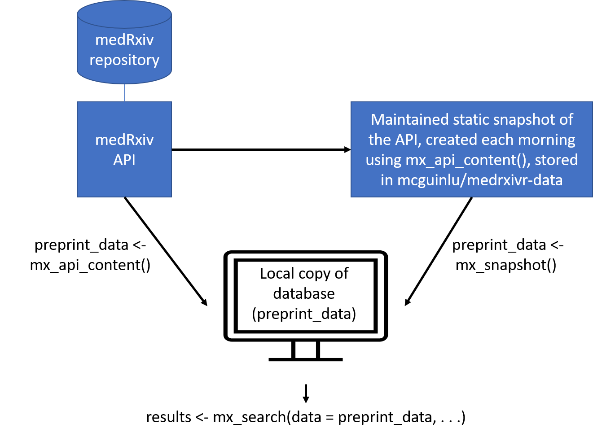

# Get started

An increasingly important source of health-related bibliographic content
are preprints - preliminary versions of research articles that have yet
to undergo peer review. The two preprint repositories most relevant to
health-related sciences are [medRxiv](https://www.medrxiv.org/) and
bioRxiv, both of which are operated by the Cold Spring Harbor
Laboratory.

The goal of the `medrxivr` R package is two-fold. In the first instance,
it provides programmatic access to the [Cold Spring Harbour Laboratory
(CSHL) API](https://api.biorxiv.org/), allowing users to easily download
medRxiv and bioRxiv preprint metadata (e.g. title, abstract, publication
date, author list, etc) into R. The package also provides access to a
maintained static snapshot of the medRxiv repository (see [Data
sources](#medrxiv-data)). Secondly, `medrxivr` provides functions to
search the downloaded preprint records using regular expressions and
Boolean logic, as well as helper functions that allow users to export
their search results to a .BIB file for easy import to a reference
manager and to download the full-text PDFs of preprints matching their
search criteria.

## Installation

When the package is available from CRAN, install the stable version
with:

``` r

install.packages("medrxivr")
library(medrxivr)
```

The canonical CRAN package page is
<https://CRAN.R-project.org/package=medrxivr>.

## Data sources

### medRxiv data

`medrixvr` provides two ways to access medRxiv data:

- `mx_api_content(server = "medrxiv")` creates a local copy of all data
  available from the medRxiv API at the time the function is run.

``` r

# Get a copy of the database from the live medRxiv API endpoint
preprint_data <- mx_api_content()  
```

- [`mx_snapshot()`](https://docs.ropensci.org/medrxivr/reference/mx_snapshot.md)
  provides access to a static snapshot of the medRxiv database. The
  package reads a manifest from the `snapshot` release assets for this
  repository, downloads the referenced compressed CSV files, and caches
  them locally. This method does not rely on the live API during
  ordinary use and is usually faster than re-extracting records from the
  API. The function prints the latest record date included in the
  snapshot; discrepancies between the most recent static snapshot and
  the live database can be assessed using
  [`mx_crosscheck()`](https://docs.ropensci.org/medrxivr/reference/mx_crosscheck.md).

``` r

# Get a copy of the database from the static snapshot
preprint_data <- mx_snapshot()  
```

The relationship between the two methods for the medRxiv database is
summarised in the figure below:



### bioRxiv data

Only one data source exists for the bioRxiv repository:

- `mx_api_content(server = "biorxiv")` creates a local copy of all data
  available from the bioRxiv API endpoint at the time the function is
  run. **Note**: due to it’s size, downloading a complete copy of the
  bioRxiv repository in this manner takes a long time (~ 1 hour).

``` r

# Get a copy of the database from the live bioRxiv API endpoint
preprint_data <- mx_api_content(server = "biorxiv")
```

## Performing your search

Once you have created a local copy of either the medRxiv or bioRxiv
preprint database, you can pass this object (`preprint_data` in the
examples above) to
[`mx_search()`](https://docs.ropensci.org/medrxivr/reference/mx_search.md)
to search the preprint records using an advanced search strategy.

``` r


# Perform a simple search
results <- mx_search(data = preprint_data,
                     query ="dementia")

# Perform an advanced search
topic1  <- c("dementia","vascular","alzheimer's")  # Combined with Boolean OR
topic2  <- c("lipids","statins","cholesterol")     # Combined with Boolean OR
myquery <- list(topic1, topic2)                    # Combined with Boolean AND

results <- mx_search(data = preprint_data,
                     query = myquery)
```

## Dataset description

The dataset (in this case, `results`) returned by the search function
above contains 14 variables:

| Variable | Description |
|:---|:---|
| ID | Unique identifier |
| title | Preprint title |
| abstract | Preprint abstract |
| authors | Author list in the format ‘LastName, InitalOfFirstName.’ (e.g. McGuinness, L.). Authors are seperated by a semi-colon. |
| date | Date the preprint was posted, in the format YYYYMMDD. |
| category | On submission, medRxiv asks authors to classify their preprint into one of a set number of subject categories. |
| doi | Preprint Digital Object Identifier. |
| version | Preprint version number. As authors can update their preprint at any time, this indicates which version of a given preprint the record refers to. |
| author_corresponding | Corresponding authors name. |
| author_corresponding_institution | Corresponding author’s institution. |
| link_page | Link to preprint webpage. The “?versioned=TRUE” is required, as otherwise, the URL will resolve to the most recent version of the article (assuming there is \>1 version available). |
| link_pdf | Link to preprint PDF. This is used by [`mx_download()`](https://docs.ropensci.org/medrxivr/reference/mx_download.md) to download a copy of the PDF for that preprint. |
| license | Preprint license |
| published | If the preprint was subsequently published in a peer-reviewed journal, this variable contains the DOI of the published version. |

## Export records identified by your search to a .BIB file

`medrxivr` provides a helper function to export your search results to a
.BIB file so that they can be easily imported into a reference manager
(e.g. Zotero, Mendeley)

``` r


mx_export(data = mx_results,
          file = tempfile(fileext = ".bib"))
```

## Download PDFs for records identified by your search

Pass the results of your search above (`results`) to the
[`mx_download()`](https://docs.ropensci.org/medrxivr/reference/mx_download.md)
function to download a copy of the PDF for each record.

``` r


mx_download(results,        # Object returned by mx_search
            tempdir(),      # Temporary directory to save PDFs to 
            create = TRUE)  # Create the directory if it doesn't exist
```

## Further guidance

Please see the *[medrxivr
website](https://docs.ropensci.org/medrxivr/index.html)* vignette for
extended guidance on developing search strategies and for detailed
instructions on interacting with the Cold Springs Harbour API for
medRxiv and bioRxiv.
